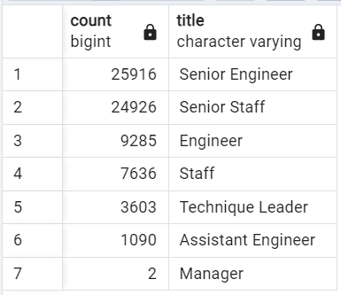
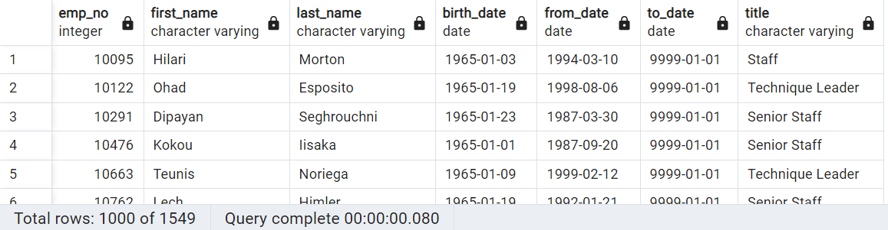

# Pewlett-Hackard-Analysis
## Overview of the analysis
Pewlett Hackard is preparing for upcoming retirements and positions that will need to be filled.  This analysis determines the number of retiring employees per title, and identify employees who are eligibile to participate in a mentorship program.  SQL (Structured Query Language) is programming language that deals with relational databases.  The use of SQL can help prepare Pewlett Hackard for the upcoming change in staff.
## Results
- 72,458 employees are eligible for retirement.
- 25,916 senior engineers are eligible for retirement.
- 2 managers are eligible for retirement.
- 1,549 employees are eligible to participate in the mentorship program.

## Summary
How many roles will need to be filled as the "silver tsunami" begins to make an impact?
- 72,458 roles will need to be filled.  Most of these roles will be for a senior software engineer role.  Of the eligible employees for retirements, 35.77% are senior engineers while .002% are managers.  As a result, HR should prioritize hiring senior engineers.

- Are there enough qualified, retirement-ready employees in the departments to mentor the next generation of Pewlett Hackard employees?
Only 1,549 employees are eligible to mentor the next generation of employees.  If 72,458 employees retire and need to be replaced, each mentor would have to help train about 47 new hires.  This is not feasible and will overwork the mentors.

